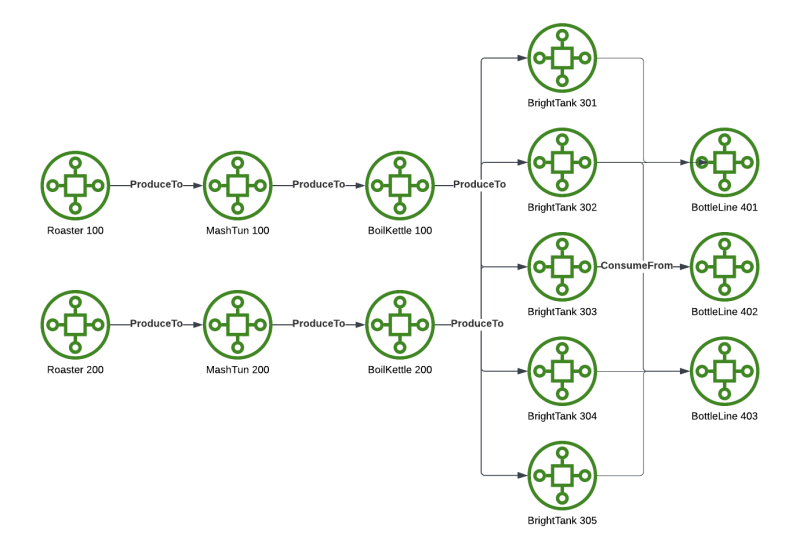
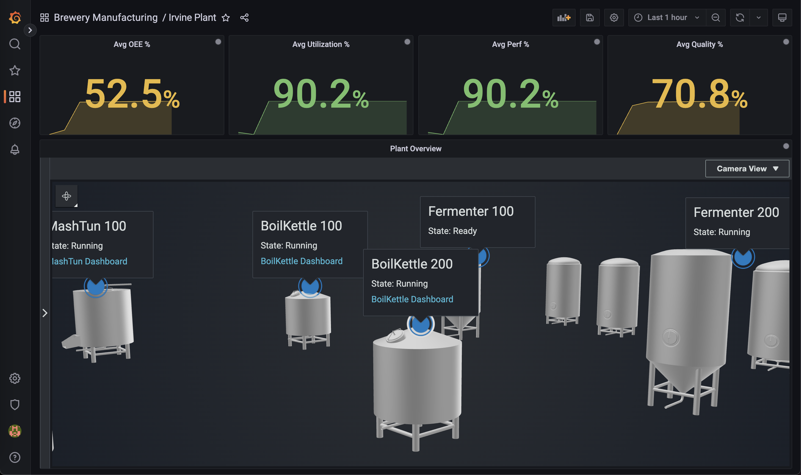
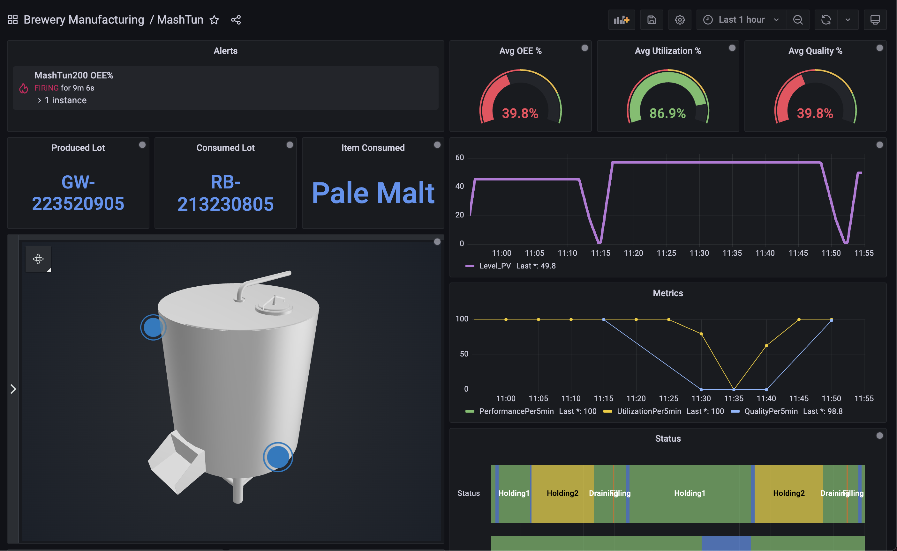
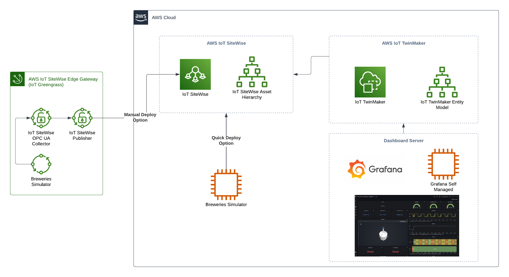
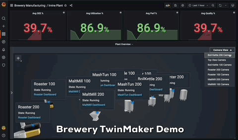
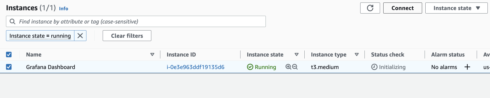
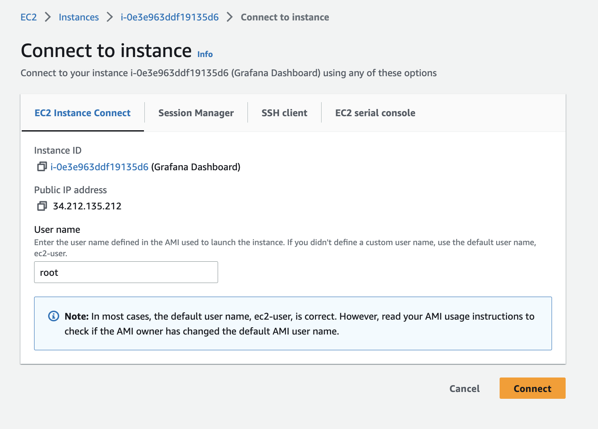

# Breweries AWS IoT TwinMaker Demo

## Overview

This Brewery Manufacturing demo provides guidance on how to build a Production Monitoring solution in an Industrial setting where Plant Managers or Line Supervisors can have visibility to plant operations, alerts, and situational awareness to downtime in a 3D visualization. Operations can monitor and diagnose alarms in a 3D visualization that helps reduce the mean time to repair (MTTR) by enabling teams to quickly see potential causes from upstream or downstream operations in a manufacturing process. This reduction in time will improve customer’s ROI by reducing downtime in operations and optimizing the output of product manufactured. 
      
## Demo Description

This demo uses the Brewery SiteWise Simulator to build an Industrial Digital Twin in AWS IoT TwinMaker.

The diagram below is a view of the brewery material flow for the Irvine plant. The Brewery simulates production and consumption of items through the process below. This includes good production, scrap, and simulation of various utilization states. Telemetry data is also generated at the various operations for sensors like temperature, levels, and valve states. With the data produced by this simulation, metrics are calculated in the SiteWise Models for OEE (Utilization, Performance, and Quality).

An IoT TwinMaker Workspace is created and synchronized with the SiteWise models and assets. A set of Grafana dashboards and IoT TwinMaker scenes have been created that enables you to navigate across different equipment within the Irvine Plant to monitor performance metrics.




## Demo Screenshots

### Irvine Plant - Overview
This high level plant view shows all the equipment in this simulated environment. Clicking on each Scene Tag will display the average KPI metrics (OEE, Performance, Quality, Utilization) for the time range of the dashboard. There is a data overlay on several assets that displays the latest State of the machine and a link to drill down into the dashboard for that asset.



### Asset Dashboards
As you drill down into an asset, such as the MashTun below, you will be presented with several types of data for that asset. This includes telemetry data, KPIs, and production order data such as lots, items, and utilization reasons. In addition, alerts have been configured in Grafana for the OEE (Overall Equipment Effectiveness) when it drops below 50%. Clicking on each Scene Tag will trend various properties on the right time-series trends.




## 1. Deploy Steps

The deployment of the demo is spread out over several cloudformation stacks. The first two stacks will deploy the data simulator and the rest will deploy the IoT TwinMaker Workspace, Grafana Dashboard server, and Dashboard role. Here is an architecture of the complete brewery demo environment:



### 1.1 Deploy Brewery SiteWise Simulator

1. Install the [Brewery SiteWise Simulator](https://github.com/aws-samples/breweries-sitewise-simulator) following the Quick Deploy steps.

### 1.2 Deploy IoT TwinMaker Workspace

1. Open this <a href="cf/BreweryWorkspace.json?raw=1" target="_blank" download>cloudformation</a> template and click "File->Save As" in your browser to download. This template deploys the IoT TwinMaker Workspace and Synchronize it with the SiteWise Assets created in step 1.
2. Go to CloudFormation in your console and click `Create Stack`.
3. Upload the template file your downloaded and proceed through the steps to deploy.
4. Wait until the stack is completed successfully. 

### 1.3a Deploy Grafana Dashboard Server (Automated)

1. Open this <a href="cf/GrafanaDashboardServer.json?raw=1" target="_blank" download>cloudformation</a> template and click "File->Save As" in your browser to download. This template deploys a self managed Grafana Dashboard server, IAM Role, IoT TwinMaker scenes, and preloaded dashboards for the Brewery demo.
2. Go to CloudFormation in your console and click `Create Stack`.
3. Upload the template file your downloaded and proceed through the steps to deploy.
4. Wait until the stack is completed successfully. 
> **_NOTE:_**  If this step fails, your EC2 instance may be receiving a forced reboot signal from Systems Manager for a patch before the script in user-data completes. Delete this failed stack and proceed to [step 1.3b](#13b-deploy-grafana-dashboard-server) for a manual install.
5. The Grafana URL is found in the Outputs tab of the Cloudformation template.
6. Open the Grafana portal. The default credential is **admin/admin**. Change this once you login.
7. Go browse for the dashboards. The simulation will take several minutes to produce items and get processed downstream.



### 1.3b Deploy Grafana Dashboard Server (Manual)

1. Open this <a href="cf/GrafanaDashboardServer_NoInstall.json?raw=1" target="_blank" download>cloudformation</a> template and click "File->Save As" in your browser to download. This template deploys a self managed Grafana Dashboard server and IAM Role. We will manually install the IoT TwinMaker scenes and preloaded dashboards for the Brewery demo.
2. Go to CloudFormation in your console and click `Create Stack`.
3. Upload the template file your downloaded and proceed through the steps to deploy.
4. Wait until the stack is completed successfully.
5. Proceed to the EC2 Console and connect to the instance.

6. Click on the tab `EC2 Instance Connect`, change the user name to `root`, and click `Connect`

7. Once logged into the session, run this script and wait for it to complete. You can ignore errors like this "ERROR:root:('Roaster200', 'null')"

``` bash
yum install -y git
git clone https://github.com/aws-samples/aws-iot-twinmaker-breweries-demo.git                             
cd aws-iot-twinmaker-breweries-demo/scripts/
sh install.sh

```
8. The Grafana URL is shown at the end of the installation and is found in the Outputs tab of the Cloudformation template.
9. Open the Grafana portal. The default credential is **admin/admin**. Change this once you login.
10. Go browse for the dashboards. The simulation will take several minutes to produce items and get processed downstream.

## Clean Up

To clean up, delete the following stacks in this order:
- Grafana Dashboard Server
- IAM Role for Grafana (Stack created by the Grafana Dashboard server)
- IoT TwinMaker Workspace (Make sure to delete the Scenes and Resources first in the IoT TwinMaker Console)
- Simulation server
- SiteWise Assets
